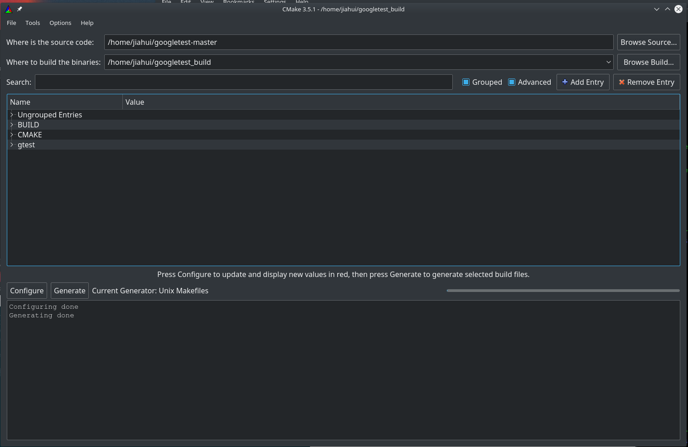
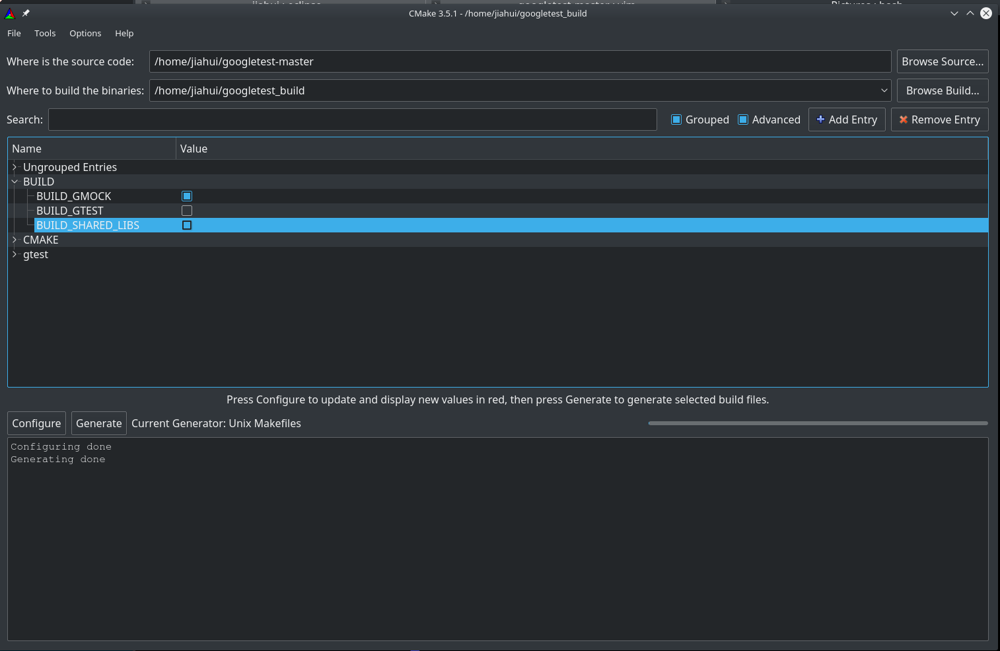
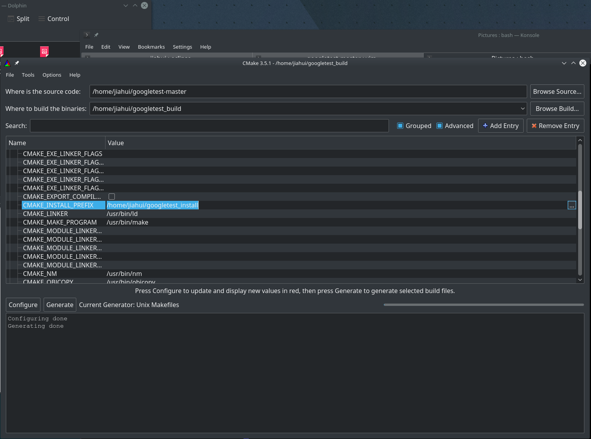

# Use GTest for Unit Test
## Install GTest
#### Download GTest from Git repo.
Download the zip file from https://github.com/google/googletest.git

#### Extract the source code from the zip file
unzip googletest-master.zip

#### Use CMake configure the software (Fig. 1)
<figure>

<figcaption> Fig. 1 Use CMake to configure google test</figcaption>
</figure>

* Build the library dynamically or statically by check / uncheck BUILD_SHARED_LIBS (Fig. 2)
<figure>

<figcaption> Fig. 2 Build google test as shared or static library</figcaption>
</figure>

* Specify the installation path using CMAKE_INSTALL_PREFIX (Fig. 3)
<figure>

<figcaption> Fig. 3 Specify the library installation path</figcaption>
</figure>

## Create test code 
* Create code (e.g., AnalyzerLib_Unit_Testing.cpp) for the test of a c++ unit (project). The code is saved in the save of the source code of the unit (e.g., /Simmune/analyzerlib/AnalyzerLib_Unit_Testing.cpp). Below is the example of the test code

``` cpp
#include <string>
#include <gmock/gmock.h>
#include <gtest/gtest.h>
#include "Mongo/MongoInterface.h"

using ::testing::Test;
using ::testing::InitGoogleMock;
using ::testing::InitGoogleTest;

class MongoInterfaceTesting : public Test
{
	// Test fixture class with pre and post processing of testing
public: // methods
	void SetUp()
	{
		// Code will execute before the testing
		std::string host = "127.0.0.1";  // local connection
		int port = 10080;
		std::string user = "user";
		std::string pw = "password";
		std::string database = "Simmune";
		bool authAdmin = true;
	    this->m_MongoInterface = new MongoInterface(host, port, user, pw, database, authAdmin);
	}
	void TearDown()
	{
		// Code will execute after the testing
		delete this->m_MongoInterface;
	}

public: // variables
	MongoInterface *m_MongoInterface;
};

TEST_F(MongoInterfaceTesting, Test_getDbName)
{
	// Testing of function getDbName() of MongoInterface class
	// getDbName() returns the name of database. Will test whether
	// it returns the same database name and whether the function
	// call throw out an exception
	std::string database = "Simmune";
	EXPECT_EQ(database, m_MongoInterface->getDbName());
	EXPECT_NO_THROW(m_MongoInterface->getDbName());
}

TEST_F(MongoInterfaceTesting, Test_setDbName)
{
	// Testing of function setDbName() of MongoInterface class
	// setDbName() assign the name of database (argument).
	// Will test whether getDbName() returns the expected database
	// name.
	std::string database = "myDatabase";
	m_MongoInterface->setDbName(database);
	EXPECT_EQ(database, m_MongoInterface->getDbName());
}

int main(int argc, char *argv[])
{
	// main function of the testing
	InitGoogleTest(&argc, argv);
	return RUN_ALL_TESTS();
}
```
 
* Add the following statements into the CMakeLists.txt of the unit. 

``` cmake

INCLUDE_DIRECTORIES("/home/jiahui/work/mongodb_gtest_bin/googletest-src/googletest/include"
                        "/home/jiahui/work/mongodb_gtest_bin/googletest-src/googlemock/include")     # include the "include" path of GTest                   
                        
LINK_DIRECTORIES("/home/jiahui/work/mongodb_gtest_bin/googletest-build/googlemock/gtest") # add the directoreis to the GTest libraries
LINK_DIRECTORIES("/home/jiahui/work/mongodb_gtest_bin/googletest-build/googlemock")


ADD_EXECUTABLE(AnalyzerLib_Unit_Testing AnalyzerLib_Unit_Testing.cpp)
TARGET_LINK_LIBRARIES(AnalyzerLib_Unit_Testing  ${Boost_LIBRARIES} vtkCommonCore vtkFiltersCore vtkInfovisCore mongocxx bsoncxx mongoc-1.0 bson-1.0 SimShare SimDb smun DensityEstimation)

TARGET_LINK_LIBRARIES(AnalyzerLib_Unit_Testing pthread)
TARGET_LINK_LIBRARIES(AnalyzerLib_Unit_Testing gmock gmock_main)
TARGET_LINK_LIBRARIES(AnalyzerLib_Unit_Testing gtest gtest_main)
```